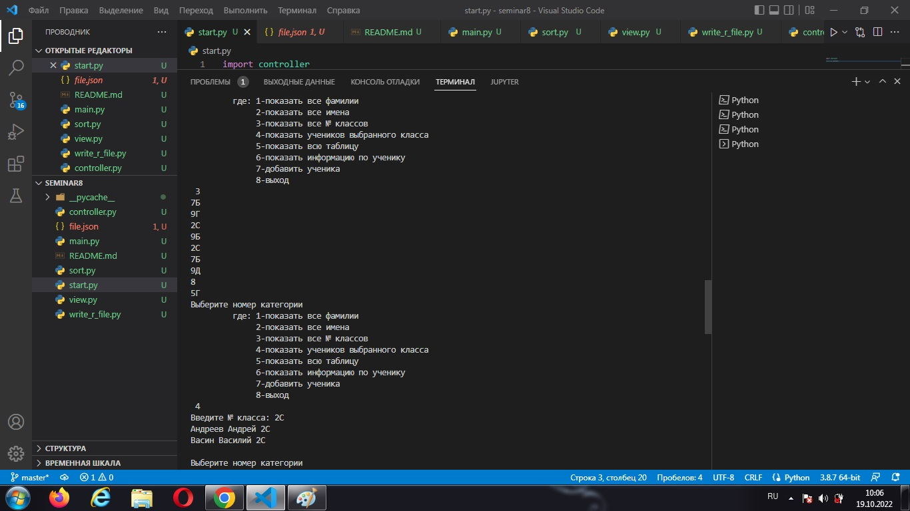

Перед вами пилотная версия программы информационной системы, работающая с учащимися школы. С ее помощоью можно создать базу данных учеников с поиском и получении полной информации по фамилии или классу.  
*Команда 1,2,3* осуществляет выборку всех учеников по фамилии, имени, классу соответственно.

*Команда 4* - сделает выборку всех учеников выбранного класса

*Команды 5 и 6* покажут все базу данных и выбранного ученика соответственно.

*команда 7* - обеспечит возможность добавления нового ученика.

*Команда 8* - выход из программы

**Модуль Start** - запускает программу.    
**Модуль Controller** - отвечает за вызов и    выполнение модулей.
**Модуль view** - выхывает меню пользователя и обеспечивает ввод необходимой команды.  
**Модуль Main** - принимает и обрабатывает введенные пользователем данные.  
**Модуль sort** - сортирует данные.  
**Модуль write_r_file** - отвечает за добавление , хранение и чтение базы данных в формате json.

